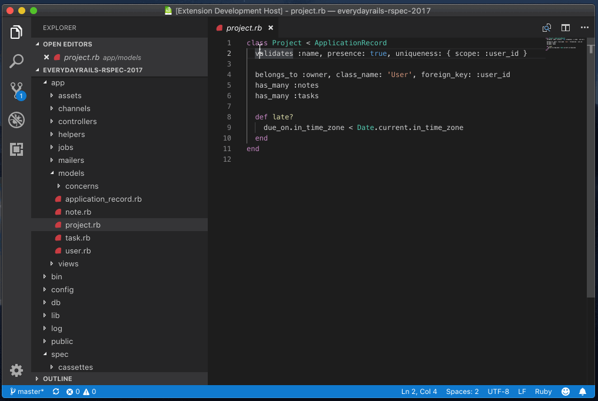

# vscode-quick-rspec

A VSCode extension that switch ruby files and spec files with shortcut key.



## Features

Available commands:

```json
"commands": [
    {
        "command": "extension.toggleSpec",
        "title": "Toggle Spec"
    },
    {
        "command": "extension.runSpec",
        "title": "Run Spec"
    }
],
"keybindings": [
    {
        "mac": "cmd+9",
        "key": "ctrl+9",
        "command": "extension.toggleSpec"
    },
    {
        "mac": "cmd+0",
        "key": "ctrl+0",
        "command": "extension.runSpec"
    }
]
```

## Extension Settings

Available settings

```
// command prefix to execute rspec
"quickRspec.commandPrefix": "bundle exec rspec",
```

## Installation

This extension is not available on VSCode Marketplace.
Install locally:

```shell
$ git clone https://github.com/mallowlabs/vscode-quick-rspec.git
$ mv vscode-quick-rspec $HOME/.vscode/extensions/
```

And restart your VSCode.
Enjoy!
